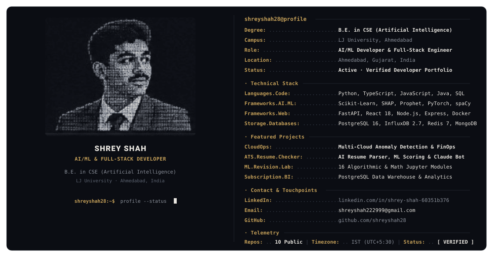

<div align="center">

<!-- Hero Banner (Theme-Adaptive Native SVG) -->
<picture>
  <source media="(prefers-color-scheme: dark)" srcset="./dark.svg">
  <source media="(prefers-color-scheme: light)" srcset="./light.svg">
  
</picture>

<br>

<p align="center">
  <a href="https://www.linkedin.com/in/shrey-shah-60351b376">
    
  </a>
  <a href="mailto:shreyshah222999@gmail.com">
    
  </a>
  <a href="https://github.com/shreyshah28">
    
  </a>
  
</p>

</div>

---

### 👨‍💻 Engineering Summary

I am an **AI/ML Developer & Full-Stack Engineer** pursuing a **B.E. in Computer Science & Engineering (Artificial Intelligence)** at **LJ University, Ahmedabad**. 

My engineering work focuses on developing data-driven systems: from **multi-cloud real-time anomaly detection pipelines** and **explainable AI (SHAP / Prophet)** to **full-stack web applications** with React, Node.js, FastAPI, PostgreSQL, and Docker.

* **Core Focus:** Intelligent Systems, Cloud Telemetry, Anomaly Detection & Scalable Web Architectures
* **Primary Languages:** Python, TypeScript, JavaScript (ES6+), Java, and SQL
* **Current Toolkit:** PyTorch, Django REST Framework, and System Design

---

### 🛠️ Verified Technical Stack

```
┌─────────────────────────┬──────────────────────────────────────────────────────────────────┐
│ Architectural Layer     │ Verified Technologies & Tooling                                  │
├─────────────────────────┼──────────────────────────────────────────────────────────────────┤
│ AI / ML & Telemetry     │ Scikit-Learn · SHAP (XAI) · Prophet · PyTorch · spaCy · Pandas   │
│ Backend Microservices   │ FastAPI (Python) · Node.js · Express.js · Django REST · Flask    │
│ Frontend & Interactive  │ React 18 · TypeScript · Vite · Tailwind CSS · ShadCN · Three.js  │
│ Real-Time & Queues      │ Socket.IO (WebSockets) · BullMQ · Redis 7 In-Memory              │
│ Databases & Storage     │ PostgreSQL 16 (ACID) · InfluxDB 2.7 (Time-Series) · MongoDB      │
│ Systems & Foundations   │ Java (JDK 8+, JDBC) · Data Structures & Algorithms · MySQL       │
│ DevOps & Orchestration  │ Docker · Docker Compose · Git · Makefiles · PowerShell / Bash    │
└─────────────────────────┴──────────────────────────────────────────────────────────────────┘
```

---

### 🚀 Primary Featured Projects

#### 01. [CloudOps — Multi-Cloud Anomaly Detection & FinOps Platform](https://github.com/shreyshah28/cloudops)
> **Real-time anomaly detection platform for multi-cloud infrastructure, featuring root cause analysis and auto-remediation.**

* **Architecture:** React 18 (TypeScript, Tailwind CSS), Node.js (Express, TypeScript, Socket.IO), Python 3.11 (FastAPI, Scikit-learn, SHAP, Prophet), InfluxDB 2.7, PostgreSQL 16, Redis 7, BullMQ, Docker Compose.
* **ML Detection Pipeline:** Evaluates infrastructure telemetry using **Isolation Forest** models, dynamic Z-score calculations, and **Prophet** forecasting.
* **Explainable AI (XAI):** Integrated **SHAP** feature attribution drawers reveal the exact telemetry metrics driving model anomaly predictions.
* **Incident Correlation:** Groups metric anomalies within 2-minute rolling windows to infer probable root causes and provides context-aware remediation suggestions.
* **Real-Time Telemetry:** Live incident feeds and metrics dashboard updated continuously over WebSocket connections.

---

#### 02. [ATS Resume Checker — AI Resume Parser & Career Intelligence Platform](https://github.com/shreyshah28/ats-resume-checker)
> **Full-stack resume analysis platform featuring ML scoring, Claude AI chatbot integration, and role-based career tools.**

* **Architecture:** React 18 (Vite, Tailwind CSS, ShadCN UI), Node.js (Express), Python (FastAPI), MongoDB, Redis, Anthropic Claude API (`claude-sonnet`), spaCy (`en_core_web_lg`), sentence-transformers.
* **Weighted ML Scoring:** Multi-factor scoring pipeline evaluating section completeness, domain keyword density, action-verb usage, metric quantification, and vector embedding similarity.
* **AI Career Chatbot:** Context-aware assistant powered by the Anthropic Claude API for resume assistance and interview preparation.
* **Platform Features:** Role-based access control (User vs. Admin dashboard), resume version comparison with diff analysis, and job description semantic matching.

---

### 🔬 Core Foundational Lab

#### 03. [Machine Learning Revision Lab](https://github.com/shreyshah28/machine-learning-revision-lab)
> **A practical Machine Learning learning and revision repository covering concepts, mathematics, algorithms, Python implementation, and model evaluation.**

* **Stack:** Python 3.x, Jupyter Notebooks (16 comprehensive modules, 1.3+ MB), NumPy, Pandas, Scikit-learn, Matplotlib, Seaborn.
* **Core Topics Covered:**
  * Supervised Learning: Linear Regression, Logistic Regression, KNN, Naive Bayes, Decision Trees, Random Forests, Support Vector Machines (SVM).
  * Unsupervised Learning & Preprocessing: K-Means Clustering, PCA (Dimensionality Reduction), Feature Scaling, Data Leakage Prevention.
  * Practical Engineering: Hyperparameter Tuning, Class Imbalance Handling, Model Evaluation Metrics, and Time-Series ML.

---

### 📦 Secondary & Specialized Projects

#### 04. [Netflix Subscription & Business Analytics System](https://github.com/shreyshah28/subscription-management-system)
> **A Python-driven subscription backend utilizing PostgreSQL for relational data modeling and complex data structures to manage user authentication, content filtering, and real-time business analytics.**

* **Stack:** Python, Streamlit, PostgreSQL, Plotly / Plotly Express, Pandas, Psycopg2.
* **Key Implementations:**
  * Multi-table PostgreSQL schema enforcing ACID transactions, connection pooling, and role-based permissions (Admin/User).
  * Custom ETL data pipeline cleaning and importing 8,000+ real-world titles from the Netflix Kaggle dataset.
  * Analytics dashboard visualizing platform revenue, subscriber growth, and catalog genre distribution.

---

#### 05. [Edelhaus Automotive v2 — Luxury Dealership & 3D Interactive WebGL Platform](https://github.com/shreyshah28/Edelhaus-automotive-v2)
> **Luxury automotive web application featuring dynamic inventory browsing, test-drive booking, and an interactive 3D WebGL car model viewer with Flask backend.**

* **Stack:** HTML5, CSS3, JavaScript (ES6+), Bootstrap 5, Python (Flask), Three.js / WebGL 3D Model Viewer (`.glb` assets).
* **Key Implementations:**
  * Interactive 360-degree 3D car model inspection with customizable camera controls.
  * Dynamic multi-brand vehicle filtering, lead tracking, and test-drive booking workflow.

---

#### 06. [Tour Planner — Java Console Booking Engine & Data Structures](https://github.com/shreyshah28/tourplanner)
> **Java console-based tour booking system with MySQL, JDBC, custom data structures, and receipt generation.**

* **Stack:** Java (JDK 8+), JDBC, MySQL, Custom Singly Linked List, HashMap, HashSet, Stored Procedures.
* **Key Implementations:**
  * In-memory user tracking using a custom singly linked list implementation.
  * Relational transaction integrity with manual `commit()` and `rollback()` handling.
  * Dynamic receipt generation with MySQL BLOB document storage and retrieval.

---

### 📈 Activity & Contribution Timeline

<div align="center">
  <picture>
    <source media="(prefers-color-scheme: dark)" srcset="https://raw.githubusercontent.com/shreyshah28/shreyshah28/output/github-contribution-grid-snake-dark.svg">
    <source media="(prefers-color-scheme: light)" srcset="https://raw.githubusercontent.com/shreyshah28/shreyshah28/output/github-contribution-grid-snake.svg">
    
  </picture>
</div>

---

### 📫 Connect & Professional Touchpoints

* **LinkedIn:** [linkedin.com/in/shrey-shah-60351b376](https://www.linkedin.com/in/shrey-shah-60351b376)
* **Email:** [shreyshah222999@gmail.com](mailto:shreyshah222999@gmail.com)
* **GitHub:** [github.com/shreyshah28](https://github.com/shreyshah28)
* **Location:** Ahmedabad, Gujarat, India (IST / UTC+5:30)

<br>

<div align="center">
  <sub>Designed &amp; Engineered by Shrey Shah · Built with factual integrity · 100% Native SVG &amp; Markdown</sub>
</div>
